# INSTITUTO SUPERIOR TECNOLÓGICO SUDAMERICANO

## CARRERA DE DESARROLLO DE SOFTWARE

### Asignatura:

**SISTEMAS OPERATIVOS**

### Estudiante:

**Anthony Marcelo Sagbay Farez**

### Semana:

**8**

### Fecha:

**27 de mayo de 2026**

### Actividad:

**PRÁCTICA - Contenedorización de una Aplicación React mediante Dockerfile Multi-Stage**

---

# 1. TÍTULO

**Generación de imagen Docker y despliegue de una aplicación Single Page Application (SPA) en React mediante la implementación de arquitecturas Multi-Stage Build y servidores Nginx.**

---

# 2. TIEMPO DE DURACIÓN

**60 minutos.**

---

# 3. FUNDAMENTOS

Docker es una tecnología de virtualización ligera que permite empaquetar aplicaciones y sus dependencias dentro de contenedores aislados, garantizando consistencia entre entornos de desarrollo, pruebas y producción. En el contexto del desarrollo web moderno, esta tecnología permite optimizar el rendimiento, seguridad y portabilidad de aplicaciones frontend y backend.

Durante esta práctica se implementaron los siguientes conceptos tecnológicos:

### React & TypeScript

Framework frontend moderno basado en componentes reutilizables que permite construir interfaces dinámicas e interactivas de alta fidelidad visual. Su integración con TypeScript fortalece el control de tipos y mejora la mantenibilidad del software.

### Multi-Stage Build (Construcción Multi-etapa)

Estrategia avanzada de Docker que divide el proceso en múltiples fases. La primera etapa utiliza herramientas pesadas como Node.js para compilar el proyecto, mientras que la segunda contiene únicamente los archivos finales listos para producción, reduciendo considerablemente el peso de la imagen.

### Nginx (Alpine)

Servidor HTTP de alto rendimiento y bajo consumo de recursos encargado de servir de forma estática los archivos compilados de React. Su variante Alpine proporciona imágenes ultraligeras optimizadas para despliegues rápidos.

### Mock API (Backend simulado)

Servicio backend independiente desarrollado para proveer endpoints REST locales, permitiendo simular un entorno conectado a bases de datos y garantizando el consumo dinámico de información desde el frontend.

### Mapeo de Puertos

Mecanismo que permite redireccionar los puertos del sistema operativo anfitrión hacia los puertos internos del contenedor, facilitando el acceso desde el navegador web.

---

# 4. CONOCIMIENTOS PREVIOS

Para la ejecución adecuada de esta práctica fue necesario contar con los siguientes conocimientos técnicos:

* Gestión y control de versiones mediante Git y GitHub.
* Administración de entornos JavaScript mediante Node.js y NPM.
* Manejo básico de Docker CLI.
* Comprensión de archivos Dockerfile.
* Uso de terminales Bash o PowerShell.

---

# 5. OBJETIVOS

## Objetivo General

Implementar el despliegue contenedorizado de una aplicación React mediante Docker utilizando la estrategia Multi-Stage Build para optimizar rendimiento y tamaño de imagen.

## Objetivos Específicos

* Clonar y analizar los repositorios frontend y backend proporcionados.
* Diseñar un Dockerfile aplicando múltiples etapas de compilación.
* Construir una imagen Docker funcional del frontend.
* Desplegar el contenedor utilizando Docker CLI.
* Validar el correcto funcionamiento del frontend en el puerto **8080**.
* Comprobar el consumo dinámico de datos desde la Mock API.

---

# 6. EQUIPO NECESARIO

Para el desarrollo de la práctica se utilizaron los siguientes recursos:

* Computador con sistema operativo **Windows 10/11**.
* Entorno de desarrollo **Antigravity IDE**.
* Motor de virtualización **Docker Desktop con WSL 2**.
* **Node.js y NPM** instalados.
* Navegador web (**Google Chrome, Edge o Firefox**).

---

# 7. PROCEDIMIENTO

## Paso 1: Clonación de Repositorios y Workspace

Se preparó el entorno de trabajo descargando desde GitHub tanto la aplicación frontend como el backend simulado encargado de proporcionar los datos dinámicos.

### Comandos ejecutados

```bash
git clone https://github.com/Daviddotcoms/suda-frontend-s6.git
git clone https://github.com/Daviddotcoms/mockAPI.git
```

### Evidencia

**Figura 1.** Clonación de repositorios mediante terminal o visualización de las carpetas descargadas.

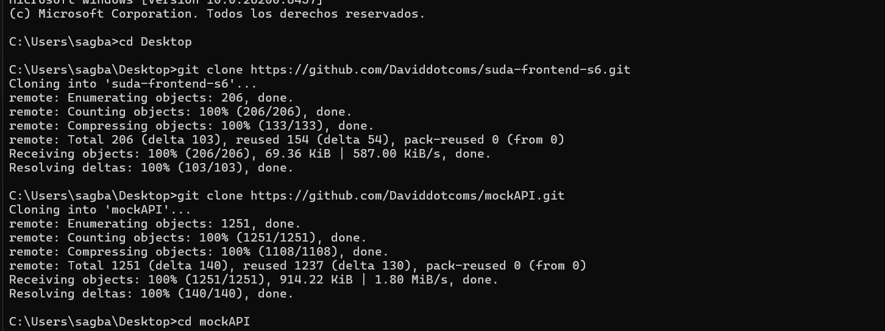

---

## Paso 2: Ejecución Local de los Servicios Nativos

Antes de proceder a la contenedorización, se verificó el correcto funcionamiento de la aplicación en entorno local.

Inicialmente se ejecutó el backend simulado para garantizar la disponibilidad de datos.

### Backend

```bash
cd mockAPI
npm install
npm start
```

Posteriormente, se ejecutó el frontend React en una terminal paralela para verificar que la interfaz renderice correctamente la lista de estudiantes.

### Frontend

```bash
cd ../suda-frontend-s6
npm install
npm run dev
```

### Evidencia

**Figura 2.** Aplicación React funcionando en entorno local sobre el puerto **5173**.

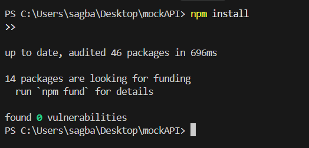
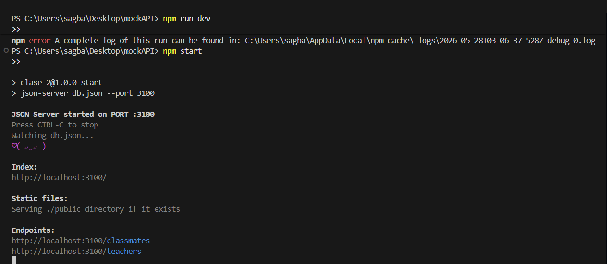
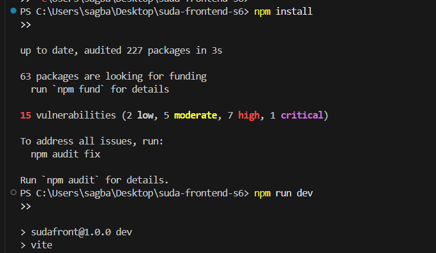
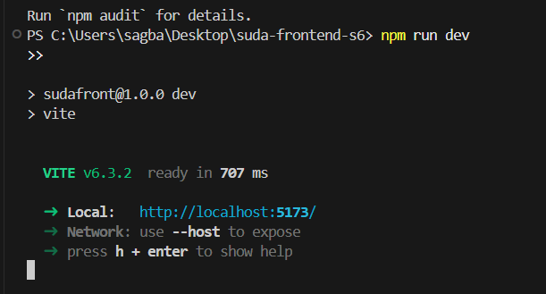

---

## Paso 3: Creación del Dockerfile Multi-Stage

Dentro del proyecto frontend se creó un archivo **Dockerfile** estructurado en dos etapas para optimizar el despliegue.

La primera etapa se encargó de la compilación mediante Node.js y la segunda utilizó Nginx Alpine para servir los archivos generados.

### Dockerfile implementado

```dockerfile
# --- ETAPA 1: Compilación ---
FROM node:18-alpine AS build

WORKDIR /app

COPY package*.json ./

RUN npm install

COPY . .

RUN npm run build

# --- ETAPA 2: Servidor de Producción ---
FROM nginx:1.25-alpine

COPY --from=build /app/dist /usr/share/nginx/html

EXPOSE 80

CMD ["nginx", "-g", "daemon off;"]
```

### Evidencia

**Figura 3.** Dockerfile configurado correctamente dentro del proyecto.

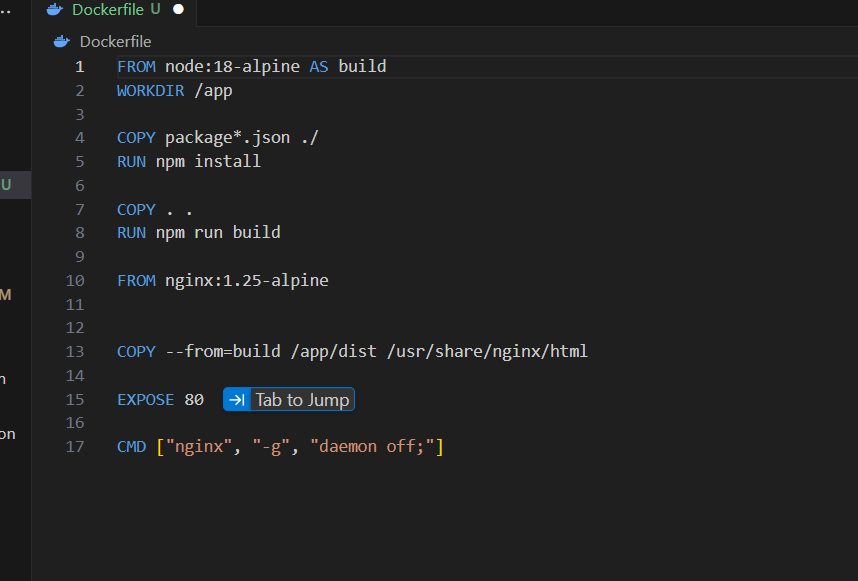

---

## Paso 4: Generación de la Imagen Docker

Con el Dockerfile preparado y Docker Desktop activo, se procedió a construir la imagen del frontend React.

### Comando ejecutado

```bash
docker build -t suda-frontend:v1.0 .
```

### Evidencia

**Figura 4.** Proceso de construcción exitoso de la imagen Docker.

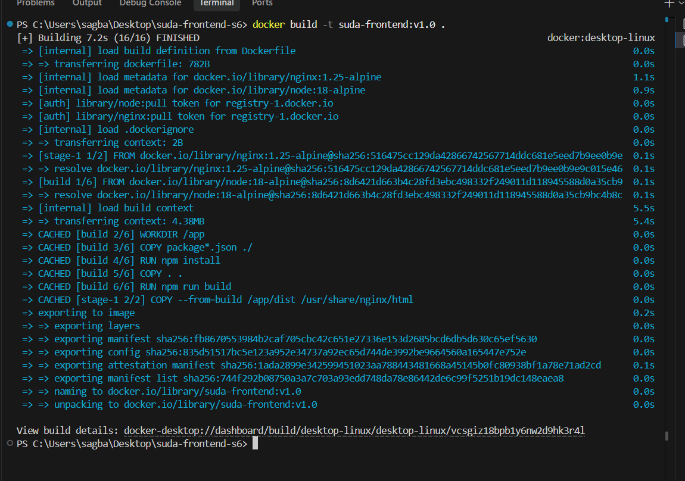

---

## Paso 5: Creación y Despliegue del Contenedor

Después de compilar la imagen, se desplegó el contenedor en segundo plano exponiendo el servicio en el puerto **8080**.

### Comando ejecutado

```bash
docker run -d --name contenedor-frontend-real -p 8080:80 suda-frontend:v1.0
```

### Evidencia

**Figura 5.** Despliegue exitoso del contenedor y generación automática del ID.

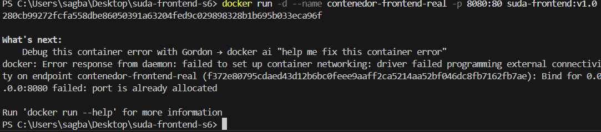
---

## Paso 6: Verificación de Estado mediante Docker CLI

Se verificó el estado operativo del contenedor utilizando el comando de inspección de procesos de Docker.

### Comando ejecutado

```bash
docker ps
```

### Evidencia

**Figura 6.** Estado del contenedor en ejecución (**Up**) y validación del mapeo del puerto **8080:80**.

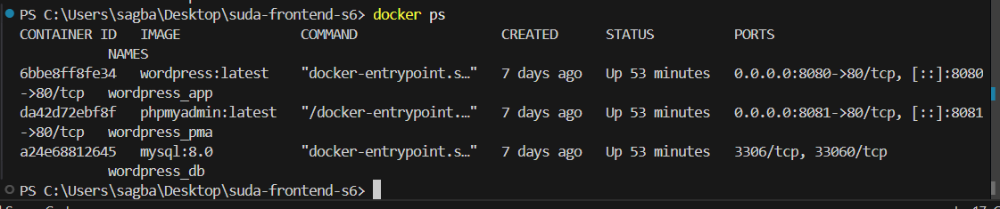
---

## Paso 7: Verificación de la Aplicación en el Navegador

Finalmente, se ingresó desde el navegador web a la URL local para comprobar el correcto funcionamiento del frontend servido mediante Nginx.

URL utilizada:

```text
http://localhost:8080
```

Se verificó que la aplicación renderice correctamente la interfaz de estudiantes y consuma los datos provenientes del backend local.

### Evidencia

**Figura 7.** Aplicación React funcionando correctamente desde Docker en el puerto **8080**.

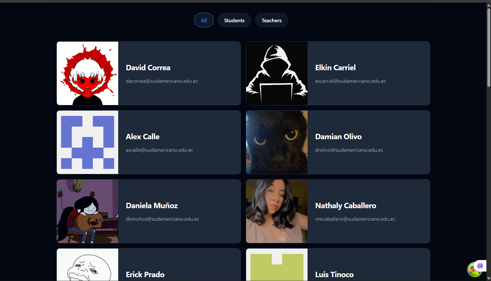
---

# 8. DIAGRAMA

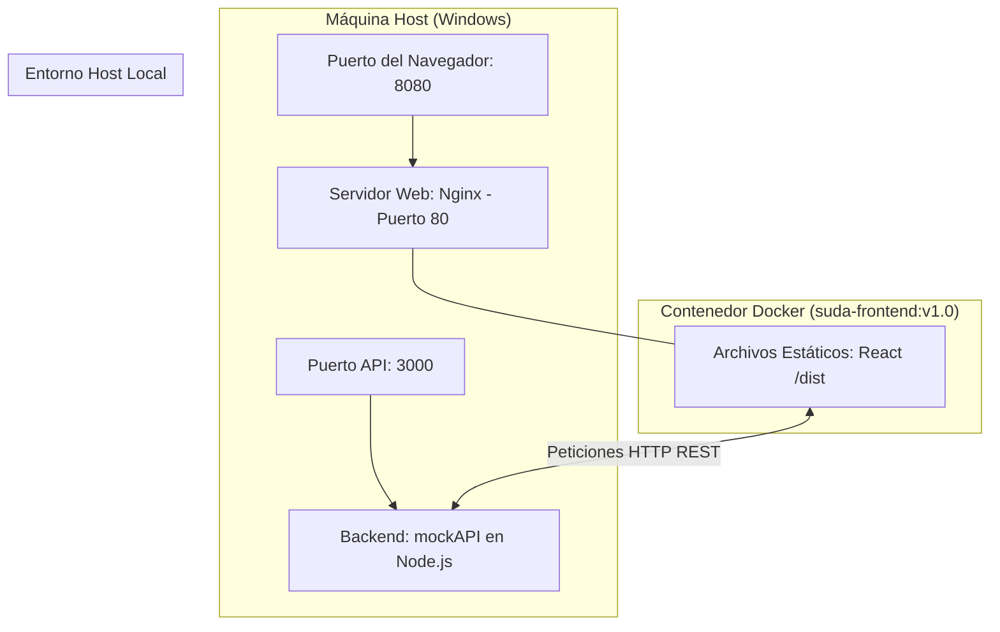

---

# 9. RESULTADOS Y CONCLUSIONES

Se logró implementar satisfactoriamente una arquitectura contenedorizada funcional para una aplicación moderna desarrollada bajo el paradigma **Single Page Application (SPA)**.

La estrategia **Multi-Stage Build** demostró ser una metodología altamente eficiente en escenarios de despliegue profesional, permitiendo utilizar Node.js exclusivamente durante la compilación y eliminando dependencias innecesarias del entorno final.

El uso de **Nginx Alpine** optimizó significativamente el tamaño de la imagen Docker, mejorando tiempos de ejecución, consumo de recursos y portabilidad del sistema.

Adicionalmente, se comprobó que la aplicación React mantiene integración funcional con el backend local (**Mock API**), consumiendo correctamente la información dinámica a través de peticiones HTTP REST.

Finalmente, la práctica permitió fortalecer competencias relacionadas con contenedorización, despliegue moderno de aplicaciones frontend y administración de servicios mediante Docker CLI, consolidando conocimientos fundamentales orientados a entornos reales de producción.

---

# 10. REFERENCIAS (APA 7)

Docker Inc. (2026). *Docker Documentation: Multi-stage builds*. https://docs.docker.com/build/building/multi-stage/

NGINX Inc. (2026). *Nginx Official Documentation and Deployment Guides*. https://nginx.org/en/docs/

React Documentation Team. (2026). *Production builds and static serving for Single Page Applications*. https://react.dev/
